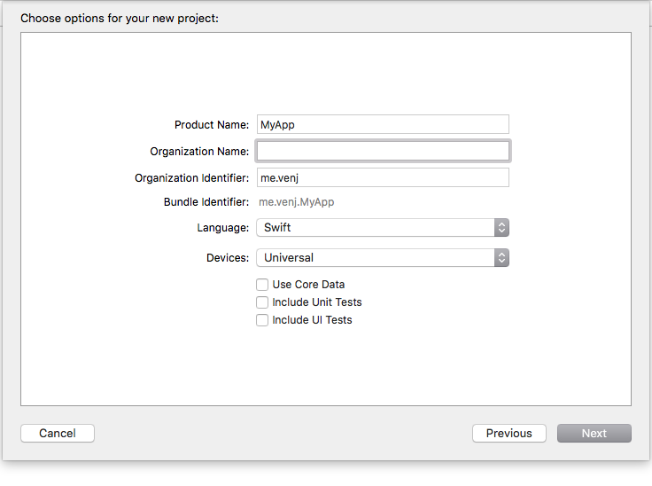

# 开始

## 基本设置

Swift被设计成可以跟Cocoa和Objective-C无缝兼容。你可以在Swift中使用Objective-C的API，你也可以在Objective-C中使用Swift的API。这使得Swift成为一个可以整合进你的开发工作流中的，简单、方便、且强大的工具。

本指南介绍了关于Swift与Objective-C之间兼容性的三个重要方面。你可以在开发Cocoa应用时加于利用：

- *互操作性*能让Swift和Objective-C代码互为接口，使你能在Objective-C中使用Swift类，同时你也能在编写Swift代码的时候，利用你熟悉的Cocoa类，设计模式和编程实践。
- *混合编程（Mix and Match）*能让你创建包含可互相通讯的Swift和Objective-C文件的混合语言应用。
- *迁移*，互操作性和混合编程功能让已有的Objective-C代码至Swift代码变得简单，让你能用包含最新的Swift特性的代码逐步替换应用中的Objective-C代码。

在你开始学习这些功能之前，你首先需要对如何创建可以访问Cocoa系统框架的Swift开发环境有所了解。

### 设置Swift开发环境

要开始用Swift进行Cocoa应用开发，你需要用Xcode的模版创建一个基于Swift的应用。

### 在Xcode中创建一个Swift项目

1. 选择 File > New > Project > (iOS, watchOS, tvOS或OS X) > Application > 选择一个模版。
2. 点击 Language 弹出菜单，选择Swift。



Swift项目的结构与Objective-C项目几乎完全一样，除了一个重要的区别：Swift没有头文件。Swift在接口和实现之间没有明确的界线，因此关于类、函数或常量的所有信息都包含在`.swift`文件之中。“[在同一个项目中使用Swift和Objective-C](./3_混合编程.md#在同一个项目中使用swift和objective-c)”章节将对此进行详述

现在，你就可以开始试着在app delegate里编写Swift代码了。你也可以通过选择 File > New > File > (iOS, watchOS, tvOS或OS X) > Source > Swift 创建一个新的Swift文件开始编码。

> **提示**
>
> 从命令行编译的可执行文件通过`@rpath`环境变量查找Swift库。如果你想发布用命令行编译的Swift可执行文件，你需要同时发布Swift的动态链接库。在Xcode里编译的Swift可执行文件会静态链接运行时环境。

### 理解Swift的框架导入过程

在你创建完Xcode项目之后，你就可以开始导入任意的Cocoa或Cocoa Touch框架，开始用Swift与Objective-C进行交互了。

支持*模块*（module）的Objective-C框架或C程序库能直接导入Swift。这包括所有的Objective-C的系统框架--例如Foundation，UIKit和SpriteKit--以及随系统提供的常用的C程序库。比如，要在Swift文件中使用Foundation API，只需把下面这行导入语句添加到文件的最上方：

``` swift
import Foundation
```

使用了导入语句之后，Swift文件就能访问所有的Foundation类、协议、方法、属性和常量了。

导入的过程很简单。Objective-C框架在头文件中暴露API。在Swift中，这些头文件被编译为Objective-C模块，接着它们以Swift API的形式导入Swift。导入的过程决定了在Objective-C中声明的函数，类，方法和类型如何在Swift中呈现。对于函数和方法，这个过程决定了它们的参数和返回值的类型。对于类型，导入的过程将产生如下影响：

- 部分Objective-C类型重映射为等价的Swift类型，例如`id`映射为`AnyObject`
- 部分Objective-C的核心数据类型重映射到Swift中的替代类型，例如`NSString`映射为`String`
- 部分Objective-C中的概念映射为Swift中相应的概念，例如把指针映射为可选类型（Optional）

要获得更多关于如何在Swift中使用Objective-C的信息，请参阅[与Objective-C API交互](./2_互操作性.md#与objective-c-api交互)。

> **提示**
>
> 你不能在Swift中直接导入C++代码。不过，你可以先用C或Objective-C封装C++代码。

把Swift导入Objective-C的模型与把Objective-C导入Swift类似。Swift通过Swift模块从框架中暴露它的API。与这些模块一起的是生成的Objective-C头文件。这些头文件声明了能映射回Objective-C的API。某些Swift API无法映射回Objective-C，因为它们利用了Objective-C中没有的语言特性。

要获得更多关于如何在Objective-C中使用Swift的信息，可以查看[同一个项目中的Swift和Objective-C](./3_混合编程.md#同一个项目中的swift和objective-c)章节。

[目录](./0_目录.md) | [2. 互操作性 >](./2_互操作性.md)
