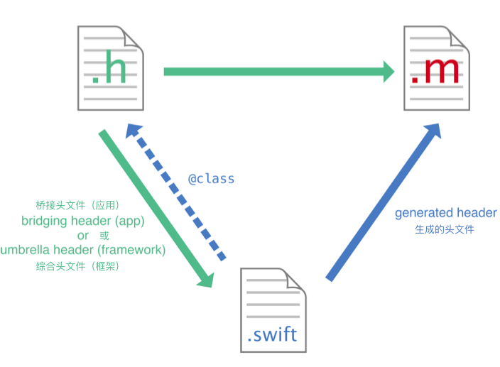

# 混合编程

## 在同一个项目中使用Swift和Objective-C

Swift与Objective-C的兼容性，能让你创建一个同时包含这两种语言代码文件的项目。你可以使用这个特性，也就是*混合编程*（mix and match），来编写混合语言（mixed-language）代码的应用。使用混合编程，你可以使用最新的Swift的特性实现程序的部分功能，同时把这部分功能整合回你已有的Objective-C代码库（codebase）。

### 混合编程概览

Objective-C和Swift的文件可以在同一个项目中共存，不论该项目最初是一个Objective-C项目还是Swift项目。你可以为现存的项目添加另一种语言的文件。这种自然的工作流使得创建混合语言的应用和框架，跟创建单一语言的应用或框架一样简单。

处理混合语言项目（target）的过程，取决于是应用项目还是框架项目而略有差异。在同一个项目中使用两种语言的基本文件导入模型参见下图，后续的章节中将对细节进行详述。

（译者按：target是一个编译目标。通常，一个项目会包含一个或多个编译目标。为了语句通顺，在翻译target的时候，为了便于理解，在不会产生误解的时候，我会根据语境，把target翻译成编译目标或项目。）



（译者按：umbrella header这里翻译为综合头文件。unbrella header是框架中使用的头文件，这个头文件用来包含框架中其他头文件，用来综合地暴露框架的接口。）

### 从同一个应用编译目标中导入代码

如果你在编写混合语言的应用，你可能需要在Swift中访问Objective-C代码，或在Objective-C中访问Swift代码。这个过程在本节中讨论，适用于非框架（non-framework）的编译目标。

#### 把Objective-C导入Swift

要在Swift代码的编译目标中导入一系列Objective-C文件，你可以使用*Objective-C桥接头文件*，将这些文件暴露给Swift。当你向一个已有的Objective-C应用中增加Swift文件，或向一个已有的Swift应用中增加Objective-C文件的时候，Xcode会引导你创建这个头文件。


如果你确认，Xcode会在创建Objective-C文件的同时创建这个头文件，并用产品模块（product module）名加上`"-Bridging-Header.h"`作为文件名。（你将在[给产品模块命名](#给产品模块命名)章节学到更多关于产品模块名的信息。）

你也可以通过 File > New > File > (iOS，watchOS，tvOS或OS X) > Source > Header File 自己手工创建一个桥接头文件。

你需要自己编辑这个头文件，把Objective-C代码暴露给Swift代码。

##### 把同一个编译目标中的Objective-C代码导入Swift

1. 在你的Objective-C桥接头文件中导入所有你想暴露给Swift的Objective-C头文件。例如：

	``` objc
	#import "XYZCustomCell.h"
	#import "XYZCustomView.h"
	#import "XYZCustomViewController.h"
	```

2. 在编译设置（Build Settings）里，在Swift Compiler - Code Generation部分，确保Objective-C Bridging Header这个编译设置包含了桥接头文件的路径。

	路径必需是相对于项目的路径，这和Build Settings里设置Info.plist时的要求是一样的。在大多数情况下，你无需修改这个设置。

在桥接头文件中列出的所有Objective-C头文件都将对Swift可见。Objecitve-C的功能会对同一个编译目标中的所有Swift文件都可用，而无需使用任何导入（import）语句。你可以像使用系统类那样，用Swift的语法调用你自己的Objective-C代码。

``` swift
let cell = XYZCustomCell()
myCell.subtitle = "A custom cell"
```

#### 把Swift导入Objective-C

当你把Swift代码导入Objective-C时，你是靠*Xcode生成的头文件*把它们暴露给Objective-C的。这个自动生成的文件是一个Objective-C头文件，声明了编译目标中Swift代码的接口。你可以认为它是Swift代码的综合头文件（umbrella header）。这个头文件的名字是产品模块名加上`"-Swift.h"`。（你将在[给产品模块命名](#给产品模块命名)章节学到更多关于产品模块名的信息。）

默认条件下，生成的头文件包含了Swift文件中有`public`修饰符的声明。如果应用编译目标包含了Objective-C桥接头文件，那么这个文件还包含所有使用`internal`修饰符的声明。使用`private`修饰符标记的声明不会出现在生成的头文件中。除非显式地使用`@IBAction`，`@IBOutlet`或`@objc`做了标记，否则私有的声明不会暴露给Objective-C。如果应用编译目标启用了测试，并且产品模块的导入语句加上了`@testable`修饰符，那么单元测试编译目标可以访问任何用`internal`修饰符标记的声明，就好像它们是用`public`修饰符标记的一样。

要了解更多关于访问控制修饰符的信息，请参考“Swift编程语言（Swift 2.2版）”的“访问控制”章节。

要创建生成的头文件，你不需要做任何事--只需在要使用它的Objective-C代码中导入这个头文件。需要注意的是，生成的头文件中的Swift接口会包含所有在你的Swift代码中用到的Objective-C类型的引用，因此，如果你在Swift代码中使用了你自己创建的的Objective-C类，那么请确保在Objective-C的`.m`文件导入Swift生成的头文件之前，先导入自定义类型的Objective-C头文件。

##### 把同一个编译目标中的Swift代码导入Objective-C

- 使用如下语法，替换成合适的文件名，可以把同一个编译目标中的Swift代码导入Objective-C的`.m`文件。

	``` objc
	#import "ProductModuleName-Swift.h"
	```

编译目标中的Swift文件将会对包含上述导入语句的Objective-C的`.m`文件可见。要了解更多关于如何在Objective-C代码中使用Swift的信息，请参考[在Objective-C中使用Swift](在Objective-C中使用Swift)章节。

<table>
	<tr><td>&nbsp;</td><td><strong>导入至Swift</strong></td><td><strong>导入至Objecitve-C</strong></td></tr>
	<tr><td>Swift代码</td><td>无需导入语句</td><td><code>#import "ProductModuleName-Swift.h"</code></td></tr>
	<tr><td>Objective-C代码</td><td>无需导入语句；需要Objecitve-C桥接头文件</td><td><code>#import "Header.h"</code></td></tr>
</table>

### 从同一个框架编译目标中导入代码

如果你编写混合语言的框架，那么你就可能需要在Objective-C代码中访问Swift或在Swift代码中访问Objective-C。

#### 把Objective-C导入Swift

要在Swift代码的框架编译目标中导入一系列Objective-C文件，你需要使用框架的Objective-C综合头文件（umbrella header）导入这些文件。

##### 把同一个框架中的Objective-C代码导入Swift

1. 在Build Settings中的Packaging部分，确保框架编译目标的Define Module选项设置为了“YES”。
2. 在综合头文件中，导入所有你要暴露给Swift的Objective-C头文件。例如：

	``` objc
	#import <XYZ/XYZCustomCell.h>
	#import <XYZ/XYZCustomView.h>
	#import <XYZ/XYZCustomViewController.h>
	```

3. Swift能看到所有公开暴露在综合头文件中的头文件，框架中的Objective-C文件会自动对框架中的所有Swift文件可用，无需额外的导入声明。你可以像使用系统类那样，用Swift的语法调用你自己的Objective-C代码。

``` swift
let myOtherCell = XYZCustomCell()
myOtherCell.subtitle = "Another custom cell"
```

#### 把Swift导入Objective-C

要在同一框架目标中的Objective-C代码中使用Swift文件，你无需在综合头文件中导入任何文件。你只需在任何需要使用Swift代码的Objective-C的`.m`文件中导入Xcode生成的头文件。

因为框架目标的生成的头文件的是框架公开接口的一部分，因此只有用`public`修饰符标记的声明才会出现在框架目标的生成的头文件中。如果Swift的类是派生自Objective-C的类，那么你还可以在框架中的Objective-C能访问用`internal`修饰符标记的属性和方法。要了解更多关于访问控制修饰符的信息，请参考“Swift编程语言（Swift 2.2版）”的“访问控制”章节。

##### 把同一个编译框架中的Swift代码导入Objective-C

1. 在Build Settings中的Packaging部分，确保框架编译目标的Define Module选项设置为了“YES”。
2. 使用如下语法，替换成合适的文件名，可以把同一个框架中的Swift代码导入Objective-C的`.m`文件。

	``` objc
	#import <ProductName/ProductModuleName-Swift.h>
	```

框架中的Swift文件将会对含有上述导入语句的Objective-C的`.m`文件可见。要了解更多关于如何在Objective-C代码中使用Swift的信息，请参考[在Objective-C中使用Swift](#在objective-c中使用swift)章节。

<table>
	<tr><td>&nbsp;</td><td><strong>导入至Swift</strong></td><td><strong>导入至Objecitve-C</strong></td></tr>
	<tr><td>Swift代码</td><td>无需导入语句</td><td><code>#import &lt;ProductName/ProductModuleName-Swift.h&gt;</code></td></tr>
	<tr><td>Objective-C代码</td><td>无需导入语句；需要综合头文件</td><td><code>#import "Header.h"</code></td></tr>
</table>

### 导入外置框架

你可以在纯Objective-C代码库（codebase）、纯Swift代码库，或混合语言的代码库中导入外置框架（external framework）。无论外置框架是用一种语言编写，还是同时包含了两种语言的文件，导入的过程都是一样的。当你导入外置框架的时候，请确保框架的Build Settings中的Define Module的值设置成了“Yes”。

你可以在其他编译目标中的任何Swift文件中使用如下语法导入框架：

``` swift
import FrameworkName
```

你可以在其他编译目标中的任何Objective-C的`.m`文件中使用如下语法导入框架：

``` objc
@import FrameworkName;
```

<table>
	<tr><td>&nbsp;</td><td><strong>导入至Swift</strong></td><td>导入至Objecitve-C</td></tr>
	<tr><td>任何语言编写的框架</td><td><code>import FrameworkName</code></td><td><code>@import FrameworkName;</code></td></tr>
</table>

### 在Objective-C中使用Swift

当你把Swift导入Objective-C之后，你就可以常规的Objective-C的语法来操作Swift类了。

``` objc
MySwiftClass *swiftObject = [[MySwiftClass alloc] init];
[swiftObject swiftMethod];
```

Swift类或协议必需使用`@objc`注解标记，才能在Objective-C中访问。这个注解告诉编译器这段Swift代码可以在Objective-C中访问。如果Swift类是派生自Objective-C类，编译器会自动为你给它加上`@objc`注解。要了解更多信息，请参考[Swift类型的兼容性](./2_互操作性.md#swift类型的兼容性)。

你可以访问用`@objc`注解标记的类或协议中的一切，只要它与Objective-C兼容。除了下面列出的这些Swift特有的特性：

- 泛型
- 元组（tuple）
- 在Swift中定义，不是以`Int`作为原始值类型的枚举
- Swift中定义的结构体
- Swift中定义的顶层函数
- Swift中定义的全局变量
- Swift中定义的类型别名（typealias）
- Swift风格的变长参数（variadics）
- 嵌套类型
- 匿名函数（curried functions）

例如，接受泛型参数的方法或者返回元组的方法是不能在Objective-C中使用的。

> **提示**
>
> 你不能在Objective-C中创建Swift类的子类。

#### 在Objective-C头文件中引用Swift的类和协议

为了避免循环引用，不要在Objective-C的头文件（`.h`）中导入Swift代码。你可以在Objective-C的接口中使用预声明（forward declare）来引用Swift的类和协议。

``` objc
// MyObject.h
@class MySwiftClass
@protocal MySwiftProtocal

@interface MyObjcClass : NSObject
- (MySwiftClass *)returnSwiftClassInstance;
- (id<MySwiftProtocal>)returnInstanceAdoptingSwiftProtocal;
// ...
@end
```

预声明的Swift类和协议只能用在方法和属性的声明中。

#### 在Objective-C实现中接受Swift的协议

通过导入Xcode生成的Swift代码的头文件，并使用类扩展（class extension），Objective-C的类可以在其实现（`.m`）文件中接受Swift的协议。

``` objc
// MyObjcClass.m
#import "ProductModuleName-Swift.h"

@interface MyObjcClass () <MySwiftProtocal>
// ...
@end

@implementation MyObjcClass
// ...
@end
```

### 覆盖Objective-C接口中的Swift名字

Swift编译器会自动把Objective-C代码自动导入为常规的Swift代码。它会把Objective-C类的工厂方法导入为Swift的构造方法，截断Objective-C的枚举类型值的名字。

可能有极少数的情况下，你的代码会无法自动处理。如果你需要修改导入Swift的Objective-C的方法，枚举值，或者选项组的值的名字，你可以使用`NS_SWIFT_NAME`宏自定义如何导入声明。

#### 类的工厂方法

如果Swift编译器未能识别类的工厂方法，你可以使用`NS_SWIFT_NAME`宏，传入Swift构造方法的签名，以使之被正确导入。例如：

``` objc
+ (instancetype)recordWithRPM:(NSUInteger)RPM NS_SWIFT_NAME(init(RPM:));
```

如果Swift编译器错误地把一个方法认作了类的工厂方法，你也可以使用`NS_SWIFT_NAME`宏，传入Swift的方法签名，以使之被正确导入。例如：

``` objc
+ (id)recordWithQuality:(double)quality NS_SWIFT_NAME(record(quality:));
```

#### 枚举

默认情况下，Swift在导入枚举类型时会截断枚举值名字的前缀。要自定枚举值的名字，你可以使用`NS_SWIFT_NAME`宏，传入Swift枚举值的名字。例如：

``` objc
typedef NS_ENUM(NSInteger, ABCRecordSide) {
	ABCRecordSideA,
	ABCRecordSideB NS_SWIFT_NAME(FlipSide),
};
```

### 使Objective-C的接口在Swift中不可用

部分Objective-C的接口可能不适合或不需要暴露给Swift。要防止Objective-C的声明被导入Swift，可以使用`NS_SWIFT_UNAVAILABLE`宏，并传一个引导API使用者使用可能的替代方案的消息给它。

比如，Objective-C类提供了一个接受一系列键值对作为变长参数的快捷构造方法。这种情况就可以建议Swift的使用者使用字典字面量代替：

``` objc
+ (instancetype)collectionWithValues:(NSArray *)values forKeys:(NSArray<NSCopying> *)keys NS_SWIFT_UNAVAILABLE("Use a dictionary literal instead");
```

试图在Swift代码中调用`+collectionWithValues:forKeys:`方法会产生一个编译错误。

### 改进Objective-C的声明

你可以对Objective-C的方法声明使用`NS_REFINED_FOR_SWIFT`宏，并在一个扩展中提供一个改进的Swift接口，原始实现在改进的接口中可被调用。例如，一个接受多于一个指针参数的Objective-C方法可以在Swift中改进为返回一个元组值。

- 构造方法在导入Swift时，在第一个外置参数名前加上了双下划线（`__`）前缀。
- 只要下标方法或赋值方法的任意一个使用了`NS_REFINED_FOR_SWIFT`标记，对象的下标取值方法就会被导入成Swift的方法，方法名是添加了双下划线（`__`）前缀的基本名，而不是Swift的下标（subscript）。
- 其他方法会被导入为名字前加上了双下划线（`__`）的方法。

对于下面这个Objective-C声明：

``` objc
@interface Color : NSObject

- (void)getRed:(nullable CGFloat *)red
		 green:(nullable CGFloat *)green
		  blue:(nullable CGFloat *)blue
		 aplha:(nullable CGFloat *)alpha NS_REFINED_FOR_SWIFT;
@end
```

现在，你就可以在扩展中提供一个改进的Swift接口了，如下：

``` swift
extension Color {
	var RGBA: (red: CGFloat, green: CGFloat, blue: CGFloat, alpha: CGFloat) {
		var r: CGFloat = 0.0
		var g: CGFloat = 0.0
		var b: CGFloat = 0.0
		var a: CGFloat = 0.0
		__getRed(&r, green: &g, blue: &b, alpha: &a)
		return (red: r, green: g, blue: b, alpha: a)
	}
}
```

### 给产品模块命名

Xcode为Swift代码生成的头文件的名字、以及Xcode为你创建的Objective-C桥接头文件的名字，是根据产品模块的名字生成的。默认情况下，产品模块名和产品名是一样的。不过如果产品名包含了非字母和数字字符，例如英文句号（`.`），在产品模块名中它们会被替换成下划线（`_`）。如果名字以数字开头，那么第一个数字也会被替换成下划线。

你也可以给产品模块名提供一个自定义的名字。Xcode会用它命名桥接头文件和生成的头文件。要修改产品模块名，你只需修改构建设置（Build Settings）中Product Module Name参数的值。

> **提示**
>
> 你不能覆盖框架的产品模块名。

### 问题诊断和注意事项

- 把Swift和Objective-C的文件看作是同一组代码，注意命名是否有冲突。
- 如果你在编写框架，请确保构建设置（Build Settings）的Packageing部分的Define Module（`DEFINE_MODULE`）参数的值为“YES”。
- 如果需要使用Objective-C的桥接头文件，请确保构建设置（Build Settings）的Swift Compiler - Code Generation部分的Objective-C Bridging Header（`SWIFT_OBJC_BRIDGING_HEADER`）参数的值被设置为桥接头文件在项目中的相对路径（如，“MyApp/MyApp-Bridging-Header.h”）。
- Xcode在命名Objective-C桥接头文件和Swift代码的生成的头文件时，使用的是产品模块名（`PRODUCT_MODULE_NAME`），而不是编译目标名（`TARGET_NAME`）。要了解更多关于产品模块命名的信息，请参阅[给产品模块命名](#给产品模块命名)章节。
- 要在Objective-C中可以访问和使用，Swift类必需派生自一个Objective-C类或者必须使用`@objc`标记。
- 当你把Swift代码导入到Objective-C中时，请牢记，Objective-C无法转译部分Swift特有的特性。要查看这个列表，请查看[把Swift导入Objective-C](#把swift导入objective-c)章节。
- 如果你在Swift代码中使用了你自己创建的的Objective-C类，那么请确保在Objective-C的`.m`文件导入Swift生成的头文件之前，先导入自定义类型的Objective-C头文件。
- 使用`private`修饰符标记的声明不会出现在生成的头文件中。除非显式地使用`@IBAction`，`@IBOutlet`或`@objc`做了标记，否则私有的声明不会暴露给Objective-C。
- 对于应用编译目标，如果包含了Objective-C的桥接头文件，使用`internal`修饰符标记的声明会出现在生成的头文件中。
- 对于框架编译目标，只有用`public`修饰符标记的声明才会出现在框架目标的生成的头文件中。如果Swift的类是派生自Objective-C的类，那么你还可以在框架中的Objective-C中访问用`internal`修饰符标记的属性和方法。要了解更多关于访问控制修饰符的信息，请参考“Swift编程语言（Swift 2.2版）”的“访问控制”章节。

[< 2. 互操作性](./2_互操性.md#开始) | [目录](./0_目录.md) | [4. 迁移到Swift >](./4_迁移到Swift.md)
